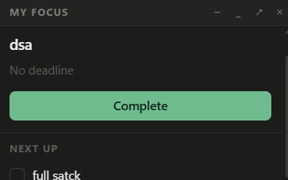
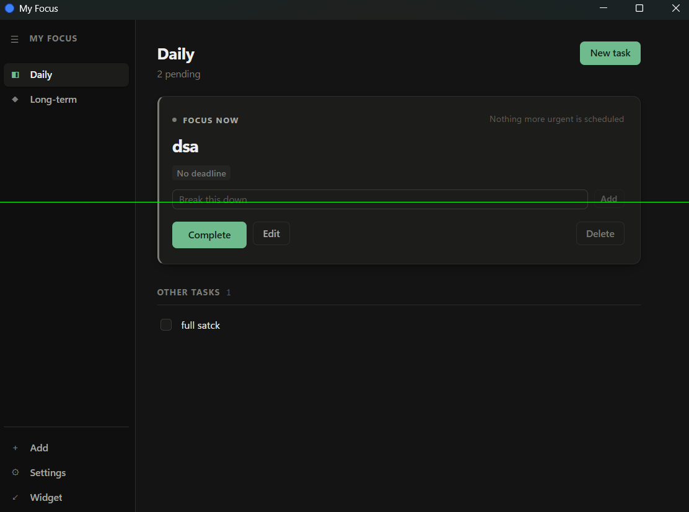
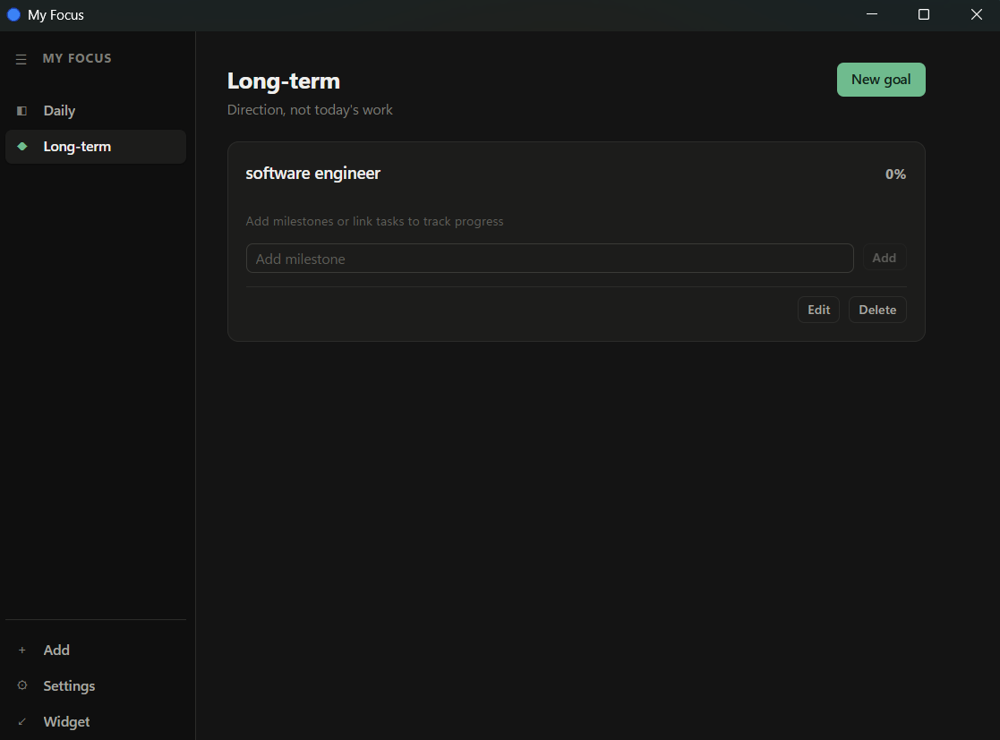

<div align="center">

# My Focus

**A small floating desktop widget for Windows that answers one question: what should I work on right now?**

[](https://tauri.app)
[](https://react.dev)
[](https://www.typescriptlang.org)
[](#testing)
[](LICENSE)

</div>

---

## The problem

Most to-do apps show you everything. You open them, see thirty items, and spend your energy deciding instead of working. The list itself becomes the task.

My Focus takes the opposite approach. It keeps a 300px widget on your desktop showing **exactly one task** — the one that matters most right now — and hides everything else behind a second window you open only when you want to plan.

You finish the task. The next one appears. That's the whole loop.

---

## What it looks like

### The floating widget

Small enough to leave on screen all day next to VS Code, Chrome or Discord. It resizes itself to fit its content, so it is never bigger than what it has to say.

<div align="center">
  
</div>

### Daily — the working view

One dominant focus card, everything else secondary. The line on the right of "FOCUS NOW" tells you *why* this task was picked, so the ranking is never a black box.

<div align="center">
  
</div>

### Long-term — the direction view

Goals live apart from today's work so they never compete with urgent tasks. Their percentage is computed from the milestones and tasks you attach — there is no field anywhere in the app for typing a progress number.

<div align="center">
  
</div>

---

## How the focus engine works

This is the core of the app, and it is deliberately **deterministic** — no AI, no randomness. The same tasks and the same clock always produce the same answer, which is what makes it testable and trustworthy.

### Priority and urgency are different things

| | Meaning | Set by |
|---|---|---|
| **Priority** | How important *you* think it is | You — Low / Normal / High / Critical |
| **Urgency** | How close the deadline is | Calculated, never editable |

A low-priority task due in 30 minutes can outrank a high-priority task due next week. That is intentional.

### Urgency thresholds

Derived purely from time remaining:

| Level | Time remaining |
|---|---|
| `normal` | 3 days or more, or no deadline |
| `approaching` | under 3 days |
| `high` | under 24 hours |
| `critical` | under 6 hours |
| `imminent` | under 1 hour |
| `overdue` | deadline passed |

### Scoring

Each pending task gets a score; the highest wins.

**1. Deadline pressure (0–100+)** — the dominant term. A smooth curve that accelerates as the deadline nears:

```
overdue    →  100 + up to 20 more, the later it gets
< 1h       →  85 → 100
< 6h       →  65 → 85
< 24h      →  45 → 65
< 3d       →  25 → 45
< 14d      →   5 → 25
further    →   4
no deadline→   8     (so dated work always comes first)
```

**2. Priority nudge** — bounded on purpose: `Critical +24`, `High +14`, `Normal 0`, `Low −10`. Enough to break ties, never enough to beat a deadline that is hours away.

**3. Soonest subtask** — if a subtask is due before its parent, the parent inherits that pressure.

**4. Work already started** — up to `+6` for a partly finished task, because finishing is cheaper than starting.

### Why focus doesn't flicker

If scoring ran unchecked, two tasks due 55 and 60 minutes out would swap places every tick. So the current focus task is an **incumbent**: it keeps focus until a challenger beats it by more than `FOCUS_SWITCH_MARGIN` (12 points). Something genuinely more critical takes over immediately; near-ties do not.

The choice is persisted, so focus survives a restart.

---

## Automatic progress

Nothing in the app lets you type a percentage. Every number is derived:

```
Task with subtasks   →  completed subtasks / total
Task without         →  0% or 100%
Long-term goal       →  average of every attached item,
                        where each milestone counts 0 or 100
                        and each linked task contributes its own progress
```

Each goal also shows its own breakdown (`2/4 milestones · 3/5 tasks`) so the percentage can always be checked by hand.

---

## Features

**Focus**
- One task surfaced at a time, chosen deterministically
- A plain-language reason for every choice
- Auto-advance to the next task on completion

**Tasks**
- Three levels, capped: Long-term goal → Task → Subtask
- Deadlines, four priority levels, optional notes
- Add, edit, complete, reopen, delete at every level
- Fast add: type a title, press Enter — everything else is behind *More options*

**Deadlines**
- Six urgency levels, shown through colour, weight and a left rule
- Live countdowns ("Due in 47 minutes")
- Overdue tasks stay visible and are never auto-deleted
- One-tap reschedule: `+1h`, `+3h`, `Tonight`, `Tomorrow`

**Desktop**
- Frameless always-on-top widget, draggable, self-sizing
- Full window for management, with a collapsible rail
- System tray with widget/app/startup/always-on-top controls
- Global shortcuts: `Ctrl+Space` show/hide, `Ctrl+N` new task
- Optional start with Windows
- Closing hides to tray; the app keeps running

**Notifications** — quiet by design
- Only three stages fire: critical, final hour, overdue
- At most **one per task per stage, ever** — nothing repeats
- First warning lead time is configurable; sound is optional

**Data**
- Fully offline. No account, no telemetry, no network calls
- Stored locally and validated on every read
- JSON export and import
- Corrupt data is set aside rather than crashing the app

**Interface**
- Dark and light themes, following Windows by default
- Urgency readable in greyscale — colour is reinforcement, not the only signal
- Keyboard throughout: `Enter` to save, `Esc` to cancel or return to the widget
- No gradients, no glassmorphism, no decorative motion

---

## Install

### Requirements

- **Windows 10 or 11**
- **Node.js 18+** — [nodejs.org](https://nodejs.org)
- **Rust** — [rustup.rs](https://rustup.rs)
- **Microsoft C++ Build Tools** — [download](https://visualstudio.microsoft.com/visual-cpp-build-tools/), select *Desktop development with C++*
- **WebView2** — already present on Windows 11 and most Windows 10 installs

### Run it

```bash
git clone https://github.com/banasa/my-focus.git
cd my-focus
npm install
npm run tauri dev
```

The first build compiles the Rust dependencies and takes a few minutes. Later builds are fast.

### Build an installer

```bash
npm run tauri build
```

Outputs an `.msi` and an `.exe` to `src-tauri/target/release/bundle/`.

---

## Usage

| Action | How |
|---|---|
| Show / hide the widget | `Ctrl + Space`, or click the tray icon |
| New task | `Ctrl + N` |
| Open the full app | `↗` in the widget, or the tray menu |
| Back to the widget | `Esc`, or *Widget* in the rail |
| Expand the widget | `+` in its title bar |
| Move the widget | Drag its title bar |
| Add a subtask | Type in *Break this down* on the focus card |
| Reveal task actions | Click a row in *Other tasks* |
| Reopen a completed task | Click its checkbox under *Completed* |

**Getting started:** add a long-term goal for direction, then add daily tasks and link them to it. Give the tasks deadlines — that is what the ranking runs on. Break the big ones into subtasks and progress starts tracking itself.

---

## Architecture

All decision-making lives in four pure services with no React in them. The UI reads their output and never computes ranking itself, which is what makes the logic unit-testable without a DOM.

```
src/
├── models/types.ts            # Data model, one source of truth
│
├── services/                  # Pure logic — no React, no DOM
│   ├── urgencyService.ts      # deadline → urgency level, time formatting
│   ├── focusService.ts        # scoring, ranking, stability, explanations
│   ├── progressService.ts     # derived completion percentages
│   ├── persistenceService.ts  # validate, migrate, export/import
│   ├── notificationService.ts # what to notify, and what not to
│   └── windowService.ts       # thin wrapper over the native commands
│
├── context/AppContext.tsx     # Reducer, one clock, side-effect wiring
│
├── components/
│   ├── Widget.tsx             # The floating widget
│   ├── Shell.tsx              # Rail + routing for the full app
│   ├── FocusCard.tsx          # The dominant focus element
│   ├── TaskRow.tsx            # Collapsible row with management actions
│   ├── DailyPage.tsx          # Focus + Other tasks + Completed
│   ├── LongTermPage.tsx       # Goals, milestones, roll-up progress
│   ├── SettingsPage.tsx       # Flat rows, no stubs
│   ├── AddItemModal.tsx       # The single Add surface
│   ├── TaskEditor.tsx         # Deliberate edit flow
│   └── primitives.tsx         # Meter, Check, DueChip, Modal, …
│
└── test/setup.ts              # In-memory localStorage for the node env

src-tauri/src/main.rs          # Window modes, tray, shortcuts, autostart
```

**Design decisions worth knowing**

- *One page, two chromes.* The widget and the full app are the same React tree. `viewMode` flips the native window between frameless 300px always-on-top and a decorated, centred 900×640 window.
- *The widget measures itself.* A `ResizeObserver` reports content height to Rust, which resizes the OS window — clamped to 150–420px. That is why there is never empty space in it.
- *One clock.* A single 30-second tick in the context drives every countdown. No per-row timers.
- *Stored data is untrusted.* Every field is validated on read; unusable entries are dropped, not allowed to crash the boot. Schema v1 data migrates automatically.

---

## Testing

```bash
npm test          # once
npm run test:watch
```

**51 tests, all passing**, covering the logic that would be hard to verify by clicking:

| Suite | Tests | What it pins down |
|---|---|---|
| `focusService` | 19 | Ranking order, the switch margin, priority never outranking an imminent deadline, determinism |
| `urgencyService` | 14 | Every threshold boundary, overdue, formatting |
| `progressService` | 9 | Roll-up weighting, empty cases, completed overrides |
| `persistenceService` | 9 | Round-trip, corrupt JSON recovery, junk rejection, v1 migration, orphaned links |

One expected line prints during the run — `Could not read saved data, starting fresh` — from the test that deliberately feeds corrupt JSON to confirm the app recovers. That log *is* the behaviour under test.

---

## Known limitations

Stated plainly rather than papered over:

- **Subtask deadlines and priorities** exist in the data model and are honoured by the ranking and display, but there is no UI yet for setting them — subtasks are added title-only.
- **Shortcuts are fixed** at `Ctrl+Space` and `Ctrl+N`. Rebinding needs a key-capture UI plus re-registration.
- **Widget opacity** dims the surface with CSS rather than true window opacity, which Tauri v1 does not expose on Windows.
- **Windows only.** The code is mostly portable, but tray behaviour and the autostart registry write are Windows-specific.

---

## Tech stack

| | |
|---|---|
| Shell | Tauri 1.5 (Rust) |
| UI | React 18 + TypeScript 5 |
| Build | Vite 5 |
| Tests | Vitest |
| Styling | Hand-written CSS with a token system — no framework |
| Storage | Local, validated JSON |

No UI library, no state library, no CSS framework. The dependency list is short on purpose.

---

## Contributing

Issues and pull requests are welcome. Two things to keep in mind:

1. **Logic belongs in a service, not a component.** If it decides something, it should be testable without rendering.
2. **Run `npm test` before opening a PR.** The ranking rules are easy to break by accident — that is exactly why they are pinned by tests.

---

## License

MIT — see [LICENSE](LICENSE).

<div align="center">
<br>
<sub>Built for people who have a lot to do and would rather not spend their attention deciding what comes first.</sub>
</div>
